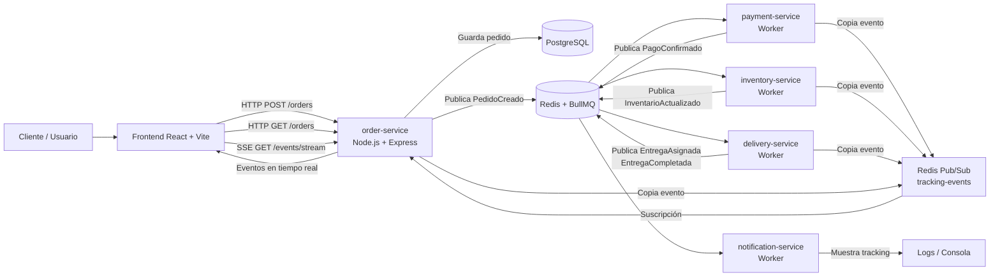
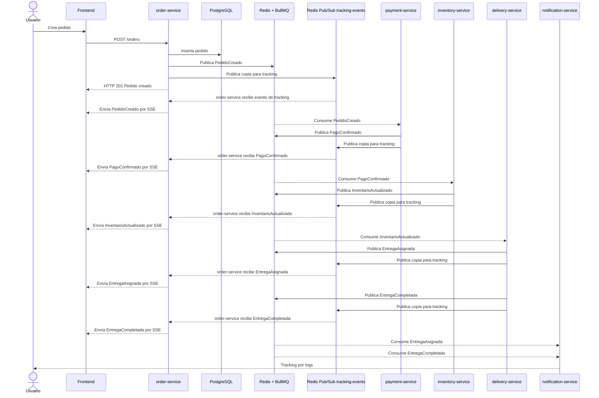

# Sistema de Logística para Entregas a Domicilio

## Grupo 6
## Arquitectura de Microservicios Orientada a Eventos

## 1. Descripción del sistema

El proyecto consiste en un sistema de logística para entregas a domicilio basado en una arquitectura de microservicios orientada a eventos. El sistema permite registrar pedidos desde una interfaz web, almacenar la información en una base de datos PostgreSQL y ejecutar en segundo plano un flujo de negocio mediante eventos procesados con Redis y BullMQ.

La solución simula el comportamiento de una plataforma de última milla, donde distintos servicios independientes reaccionan ante eventos del negocio como la creación de un pedido, confirmación de pago, actualización de inventario, asignación de entrega y finalización de entrega.

El sistema fue diseñado para demostrar desacoplamiento entre servicios, procesamiento asíncrono, consistencia eventual, trazabilidad distribuida y separación de responsabilidades.

Además, se agregó una sección de eventos en tiempo real en el frontend. Esta sección permite visualizar el flujo completo del pedido conforme los microservicios procesan los eventos `PedidoCreado`, `PagoConfirmado`, `InventarioActualizado`, `EntregaAsignada` y `EntregaCompletada`.

## 2. Problema que resuelve

En una plataforma de entregas, la creación de un pedido no debería depender directamente de que todos los procesos posteriores terminen de ejecutarse en el mismo instante. Si el pago, inventario, entrega o notificación fallan, el sistema no debería detener completamente la creación del pedido.

Un enfoque monolítico generaría alto acoplamiento, mayor dificultad de mantenimiento y menor tolerancia a fallos. Por ello, este proyecto utiliza una arquitectura orientada a eventos, donde cada servicio procesa una parte del flujo de forma independiente.

La visualización de eventos en tiempo real también ayuda a resolver un problema de observabilidad, ya que permite demostrar de forma clara cómo avanza un pedido a través de los distintos microservicios.

## 3. Alcance del MVP

El MVP implementado incluye:

- Creación de pedidos desde un frontend web.
- Persistencia de pedidos en PostgreSQL.
- Publicación del evento `PedidoCreado`.
- Procesamiento asíncrono del pago.
- Publicación del evento `PagoConfirmado`.
- Actualización simulada de inventario.
- Publicación del evento `InventarioActualizado`.
- Asignación simulada de entrega.
- Publicación de los eventos `EntregaAsignada` y `EntregaCompletada`.
- Notificaciones y tracking mediante logs.
- Visualización de eventos en tiempo real desde el frontend.
- Consulta de pedidos desde API HTTP.
- Dashboard web con resumen de ventas y tabla de pedidos.
- Ejecución local completa mediante Docker Compose.

## 4. Requerimientos funcionales

### RF1. Crear pedidos

El sistema debe permitir registrar pedidos con nombre del cliente, teléfono, dirección, productos y monto total.

### RF2. Publicar eventos de negocio

Después de crear un pedido, el sistema debe publicar el evento `PedidoCreado` para iniciar el flujo asíncrono.

### RF3. Procesar eventos mediante workers

Los servicios de pagos, inventario, entregas y notificaciones deben reaccionar a eventos previos utilizando workers independientes.

### RF4. Consultar información operativa

El sistema debe permitir consultar pedidos registrados, filtrar por estado y visualizar un resumen general de pedidos y ventas.

### RF5. Visualizar eventos en tiempo real

El frontend debe mostrar una línea de tiempo con los eventos generados durante el flujo del pedido, permitiendo observar la trazabilidad del sistema mientras los workers procesan cada etapa.

## 5. Requerimientos no funcionales

### RNF1. Disponibilidad

Los servicios se ejecutan en contenedores independientes, permitiendo aislar fallos y reiniciar servicios sin detener toda la solución.

### RNF2. Consistencia eventual

El sistema acepta consistencia eventual, ya que el pedido se registra inmediatamente y los procesos posteriores se ejecutan en segundo plano.

### RNF3. Escalabilidad horizontal

Los workers pueden escalarse aumentando la cantidad de instancias de cada servicio consumidor para procesar más eventos en paralelo.

### RNF4. Observabilidad

El sistema debe permitir observar el flujo de eventos del pedido en tiempo real mediante una sección visual en el frontend, sin afectar el procesamiento principal de las colas.

## 6. Stack tecnológico

| Tecnología | Uso |
|---|---|
| Node.js | Desarrollo de microservicios |
| Express | API HTTP del servicio de pedidos |
| React + Vite + TypeScript | Frontend web |
| PostgreSQL | Base de datos transaccional |
| Redis | Motor de colas y canal Pub/Sub para tracking |
| BullMQ | Productores y workers de eventos |
| ioredis | Cliente Redis para publicar y suscribirse al canal de tracking |
| Server-Sent Events | Envío de eventos en tiempo real desde backend hacia frontend |
| Docker | Contenedores |
| Docker Compose | Orquestación local |

## 7. Servicios implementados

| Servicio | Responsabilidad |
|---|---|
| frontend | Interfaz web para crear pedidos, consultar pedidos y visualizar eventos en tiempo real |
| order-service | Crea pedidos, guarda en PostgreSQL, publica `PedidoCreado` y expone `/events/stream` |
| payment-service | Consume `PedidoCreado`, publica `PagoConfirmado` y envía copia al canal de tracking |
| inventory-service | Consume `PagoConfirmado`, publica `InventarioActualizado` y envía copia al canal de tracking |
| delivery-service | Consume `InventarioActualizado`, publica eventos de entrega y envía copia al canal de tracking |
| notification-service | Consume eventos de entrega y muestra tracking por logs |
| redis | Infraestructura de colas y canal Pub/Sub `tracking-events` |
| postgres | Persistencia de pedidos |

## 8. Justificación de la arquitectura

La arquitectura orientada a eventos es adecuada para un sistema de logística porque las operaciones del negocio ocurren como una cadena de reacciones. Cuando un pedido se crea, otros servicios deben responder a ese evento sin estar fuertemente acoplados entre sí.

El servicio de pedidos no llama directamente al servicio de pagos, inventario o entregas. En su lugar, publica un evento en Redis mediante BullMQ. Los workers consumen esos eventos y continúan el flujo de forma asíncrona.

Esto permite bajo acoplamiento, alta cohesión, desacoplamiento temporal y mejor tolerancia a fallos. Además, el uso de `correlationId` permite mantener trazabilidad distribuida entre los eventos de un mismo pedido.

También se agregó una capa de observabilidad en tiempo real usando Redis Pub/Sub y Server-Sent Events. Esta capa no reemplaza el flujo principal de BullMQ, sino que permite enviar copias de los eventos al frontend para demostrar visualmente cómo avanza el pedido por los microservicios.

## 9. Trade-offs

| Ventaja | Desafío aceptado |
|---|---|
| Bajo acoplamiento entre servicios | Mayor complejidad para depurar |
| Procesamiento asíncrono | Los datos no se actualizan de forma inmediata |
| Escalabilidad por servicio | Más configuración operativa |
| Reintentos automáticos | Se debe controlar idempotencia |
| Flujo distribuido | Se requiere trazabilidad mediante `correlationId` |
| Eventos en tiempo real en frontend | Se agrega una capa extra de observabilidad |
| Redis Pub/Sub para tracking | No reemplaza persistencia histórica de eventos |

El proyecto acepta estos trade-offs porque el dominio de logística se beneficia del procesamiento asíncrono, la separación por responsabilidades y la posibilidad de observar el flujo completo del pedido en tiempo real.

## 10. Modelo de datos

Tabla principal: `orders`

| Campo | Tipo | Descripción |
|---|---|---|
| id | UUID | Identificador único del pedido |
| customer_name | VARCHAR(120) | Nombre del cliente |
| customer_phone | VARCHAR(30) | Teléfono del cliente |
| customer_address | TEXT | Dirección de entrega |
| status | VARCHAR(50) | Estado inicial del pedido |
| total_amount | NUMERIC(10,2) | Total del pedido |
| items | JSONB | Lista de productos del pedido |
| created_at | TIMESTAMP | Fecha de creación |
| updated_at | TIMESTAMP | Fecha de actualización |

## 11. Eventos del sistema

Los eventos implementados son:

| Evento | Publicador | Consumidor |
|---|---|---|
| PedidoCreado | order-service | payment-service |
| PagoConfirmado | payment-service | inventory-service |
| InventarioActualizado | inventory-service | delivery-service |
| EntregaAsignada | delivery-service | notification-service |
| EntregaCompletada | delivery-service | notification-service |

Además de enviarse a las colas principales de BullMQ, los eventos también se publican como copia en el canal Redis Pub/Sub:

```txt
tracking-events
```

Este canal permite que el frontend muestre los eventos en tiempo real mediante el endpoint:

```txt
GET /events/stream
```

## 12. Esquema del evento PedidoCreado

```json
{
  "eventId": "uuid",
  "eventType": "PedidoCreado",
  "correlationId": "uuid",
  "occurredAt": "2026-05-27T16:00:00.000Z",
  "source": "order-service",
  "data": {
    "orderId": "uuid",
    "customerName": "Gustavo Esteban",
    "customerPhone": "5555-5555",
    "customerAddress": "Jalapa, Guatemala",
    "items": [
      {
        "productId": "PROD-001",
        "name": "Pizza grande",
        "quantity": 1,
        "price": 120.75
      },
      {
        "productId": "PROD-002",
        "name": "Bebida",
        "quantity": 2,
        "price": 15
      }
    ],
    "totalAmount": 150.75,
    "status": "CREATED",
    "message": "Pedido creado correctamente"
  }
}
```

## 13. Diagrama de arquitectura general



## 14. Diagrama de secuencia del flujo asíncrono



## 15. Flujo de ejecución del pedido

1. El usuario crea un pedido desde el frontend.
2. `order-service` recibe la solicitud HTTP.
3. `order-service` guarda el pedido en PostgreSQL.
4. `order-service` publica el evento `PedidoCreado`.
5. `order-service` publica una copia del evento en el canal `tracking-events`.
6. El frontend recibe `PedidoCreado` mediante SSE.
7. `payment-service` consume `PedidoCreado`.
8. `payment-service` publica `PagoConfirmado`.
9. `payment-service` publica una copia en `tracking-events`.
10. El frontend recibe `PagoConfirmado`.
11. `inventory-service` consume `PagoConfirmado`.
12. `inventory-service` publica `InventarioActualizado`.
13. `inventory-service` publica una copia en `tracking-events`.
14. El frontend recibe `InventarioActualizado`.
15. `delivery-service` consume `InventarioActualizado`.
16. `delivery-service` publica `EntregaAsignada`.
17. `delivery-service` publica una copia en `tracking-events`.
18. El frontend recibe `EntregaAsignada`.
19. `delivery-service` publica `EntregaCompletada`.
20. `delivery-service` publica una copia en `tracking-events`.
21. El frontend recibe `EntregaCompletada`.
22. `notification-service` consume eventos de entrega y muestra tracking por logs.

## 16. Endpoints implementados

| Método | Endpoint | Descripción |
|---|---|---|
| GET | `/health` | Verifica estado del servicio |
| POST | `/orders` | Crea un pedido |
| GET | `/orders` | Lista todos los pedidos |
| GET | `/orders/:id` | Consulta un pedido específico |
| GET | `/orders/status/:status` | Filtra pedidos por estado |
| GET | `/orders/stats/summary` | Muestra resumen de pedidos y ventas |
| GET | `/events/stream` | Envía eventos en tiempo real al frontend mediante Server-Sent Events |

## 17. Ejecución local

Para levantar todo el sistema:

```bash
docker compose up --build
```

Frontend:

```txt
http://localhost:8080
```

API de pedidos:

```txt
http://localhost:3000/health
```

Lista de pedidos:

```txt
http://localhost:3000/orders
```

Resumen:

```txt
http://localhost:3000/orders/stats/summary
```

Eventos en tiempo real:

```txt
http://localhost:3000/events/stream
```

Para observar los eventos en tiempo real, se debe abrir el frontend en `http://localhost:8080`, crear un pedido y revisar la sección **Eventos en tiempo real**.

## 18. Comandos útiles para evidencia

Ver contenedores activos:

```bash
docker compose ps
```

Ver logs del servicio de pagos:

```bash
docker compose logs -f payment-service
```

Ver logs del servicio de inventario:

```bash
docker compose logs -f inventory-service
```

Ver logs del servicio de entregas:

```bash
docker compose logs -f delivery-service
```

Ver logs del servicio de notificaciones:

```bash
docker compose logs -f notification-service
```
## 19. Conclusión

El proyecto implementa una solución funcional de logística para entregas a domicilio utilizando una arquitectura de microservicios orientada a eventos.

La solución cumple con la arquitectura asignada al grupo, ya que utiliza comunicación basada en eventos, servicios desacoplados, workers asíncronos, Redis con BullMQ, PostgreSQL y Docker Compose.

El sistema evidencia separación de responsabilidades, consistencia eventual, trazabilidad distribuida mediante `correlationId` y procesamiento asíncrono de eventos de negocio.

Además, la implementación de eventos en tiempo real mediante Redis Pub/Sub, ioredis y Server-Sent Events permite mostrar visualmente cómo un pedido avanza entre los microservicios, facilitando la demostración técnica del flujo completo.